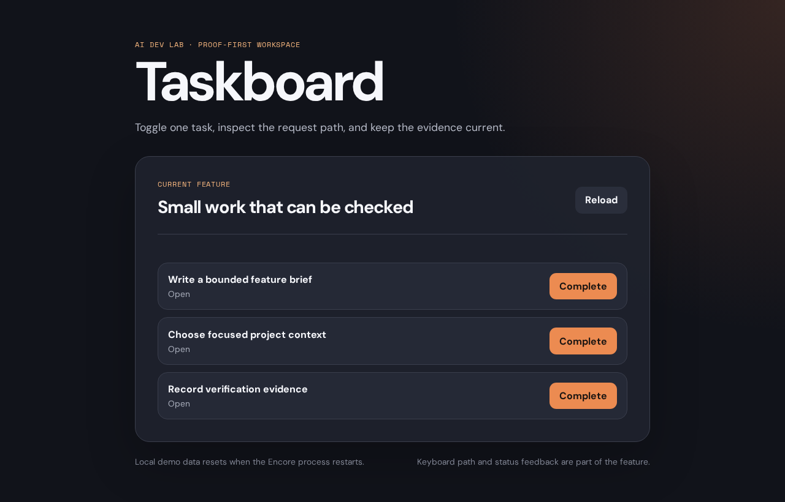

# Taskboard AI Lab

[](https://github.com/amikad09/taskboard-ai-lab/actions/workflows/ci.yml)

A small, local full-stack workspace for learning how to use AI agents without
turning the codebase into a guessing game.

You will follow one feature from the browser to the backend and back again,
while learning to:

- give an agent only the context it needs;
- keep plans, rules, and handoffs in short project documents;
- make a bounded change through Encore.ts, React, and shared TypeScript types;
- prove behavior with tests, type checks, lint, builds, and a browser check;
- introduce a reversible fault and see whether the checks catch it; and
- ask a fresh reviewer to challenge the result before you call it finished.

The app is fictional and local-only. It has no accounts, credentials,
payments, database, production deployment, or external API.



## Start in five minutes

You can either fork this repository on GitHub or clone it directly:

```bash
git clone https://github.com/amikad09/taskboard-ai-lab.git
cd taskboard-ai-lab
```

Install the exact toolchain declared by the repository, then install the
Encore CLI using [Encore's official instructions](https://encore.dev/docs/cli/cli-reference):

```bash
node --version       # 24.21.0
pnpm --version       # 12.10.1
pnpm install --frozen-lockfile
```

Run the backend in one terminal:

```bash
pnpm dev:backend
```

Run the browser in a second terminal:

```bash
pnpm dev:web
```

Open the Vite URL printed in the second terminal. The local Encore dashboard
also shows the service catalog, API explorer, and traces. Restarting Encore
restores the deterministic in-memory task data.

## Fork fast or learn the method

**Fork fast** gets you to a working feature immediately. Read the root
instructions, run the baseline, and start the open-task-count brief in
[`docs/plans/active.md`](docs/plans/active.md).

**Learn by doing** follows the complete agent loop:

```text
map → plan → implement → verify → fresh review → repair → handoff
```

Both routes use the same checks. Forking skips setup repetition; it never
skips review, tests, or safety decisions. The course version of this route is
available in the [Repsnord AI Dev Lab community](https://www.skool.com/repsnord-ai-dev-lab-2005/classroom/04ddd7ed).

## What is inside

```text
apps/web                    Vite + React browser
apps/backend                Encore.ts API service
packages/contracts          shared request and response types
packages/taskboard-core     framework-free state transitions
packages/typescript-config  shared compiler settings
docs                        project memory, checks, and learner tasks
.aiassistant                 short rules, role packets, and prompt templates
AGENTS.md                   Codex repository instructions
CLAUDE.md                   Claude Code project memory
.vscode                     small, optional editor profile
```

The feature path is deliberately visible:

```text
browser → React → Encore endpoint → contract → pure task state
        ← typed response ←
```

Turborepo coordinates package tasks and dependencies. A cache hit only says
that work was reused; it is not evidence that behavior is correct. Encore
owns the backend boundary and local service runtime. The pure core has no
network, framework, filesystem, or clock dependency.

## The finite proof route

Run the blocking checks together:

```bash
pnpm verify
```

That command runs formatting, TypeScript, Encore compilation, lint, package
tests, Encore tests, and the build. For composed browser behavior, install a
Chromium browser once and run:

```bash
pnpm test:browser:install
pnpm test:browser
```

Knip is intentionally a separate dead-code graph diagnostic:

```bash
pnpm deadcode
```

Manual keyboard/focus checks, the reversible fault lab, fresh review, and
usage notes are separate evidence. A green command does not prove a fixed
token saving or production readiness.

## Agent instructions that stay understandable

Read [`docs/README.md`](docs/README.md), [`docs/project-map.md`](docs/project-map.md),
[`docs/plans/active.md`](docs/plans/active.md), and
[`docs/checks/latest.md`](docs/checks/latest.md) before editing.

- [`AGENTS.md`](AGENTS.md) is the Codex entry point.
- [`CLAUDE.md`](CLAUDE.md) is the Claude Code entry point.
- [`.aiassistant/`](.aiassistant/) holds short provider-neutral rules and role
  packets.
- [`docs/agent-instruction-layers.md`](docs/agent-instruction-layers.md)
  explains how the layers fit together.

An instruction file guides an agent; it does not grant permissions or create a
security boundary. Keep secrets out of prompts and repository text, inspect
the proposed files before edits, and require human approval for external or
destructive actions.

## Versions and support

The repository records one tested set of versions so a learner can reproduce
the route:

```text
Node.js 24.21.0 · pnpm 12.10.1 · Encore 1.58.6
TypeScript 7.0.2 · React 19.3.0 · Vite 8.3.3
Turborepo 2.11.7 · Vitest 5.0.3 · Oxlint 1.87.0
Oxfmt 0.72.0 · Knip 6.40.0 · Playwright 1.64.0
```

When the course is refreshed, resolve a compatible set, run the full route on
a clean checkout, and update the pins together. Do not replace the pins with
an unbounded `latest` command.

## Contributing and safety

Start with one bounded task and a passing baseline. Keep examples fictional,
avoid credentials and personal data, and include the checks that support your
claim. See [`CONTRIBUTING.md`](CONTRIBUTING.md) and [`SECURITY.md`](SECURITY.md).

This project is released under the [MIT License](LICENSE). It is a learning
starter, not a production template or a promise of hosted support.
